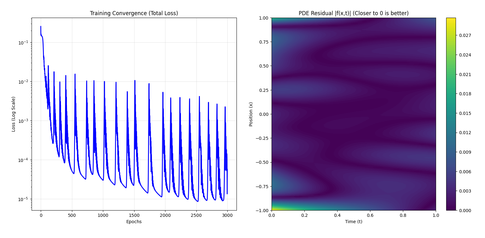
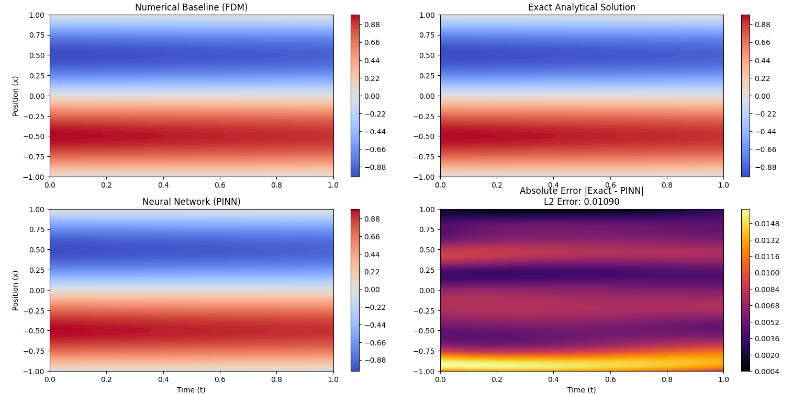

# Physics-Informed Neural Network (PINN) for Scientific Computing

## 📌 Problem Statement

Traditional Numerical Modeling techniques (like Finite Difference or Finite Element Methods) require rigid mesh discretization and face strict stability constraints (CFL conditions) when simulating transport phenomena.

This project solves the 1D Heat Diffusion Equation by implementing a Physics-Informed Neural Network (PINN) in PyTorch. The model embeds the governing Partial Differential Equation (PDE) directly into the loss function using automatic differentiation, offering a continuous, mesh-free solution. The PINN is rigorously benchmarked against both an explicit Finite Difference Method (FDM) and the exact Analytical Solution.

## 🧮 The Governing Physics

The continuous transport of heat is governed by the parabolic PDE:
$$\frac{\partial u}{\partial t} = \alpha \frac{\partial^2 u}{\partial x^2}$$

**Domain & Constraints:**

- **Spatial Domain:** $x \in [-1, 1]$
- **Temporal Domain:** $t \in [0, 1]$
- **Thermal Diffusivity:** $\alpha = 0.01$
- **Initial Condition:** $u(x, 0) = -\sin(\pi x)$
- **Boundary Conditions:** $u(-1, t) = 0$ and $u(1, t) = 0$
- **Analytical Truth:** $u(x, t) = -e^{-\alpha \pi^2 t} \sin(\pi x)$

## ⚙️ Methodology & Architecture

### Network Diagram

```text
Inputs: (x, t)
   │
   ├─► [ Dense Layer (32) + Tanh ]
   ├─► [ Dense Layer (32) + Tanh ]
   ├─► [ Dense Layer (32) + Tanh ]
   ├─► [ Dense Layer (32) + Tanh ]
   │
Output: Temperature u(x, t)
```

Note: The tanh activation function is utilized strictly to ensure continuous, non-zero second-order spatial derivatives required to calculate the PDE residual via PyTorch Autograd.

## Training Configuration

- **Optimizer:** Adam
- **Learning Rate:** $5\times10^{-3}$
- **Epochs:** 3,000
- **Collocation Strategy:** Uniform random sampling
- **Dataset:** 10,000 physics (collocation) points; 1,500 boundary/initial points

## 📊 Experimental Results & Validation

The network achieved stable convergence while strictly respecting the governing physics without relying on labeled grid data.

## Training Convergence and PDE Residual



## Comparison



### Error Metrics

- **L2 Relative Error:** 0.01090
- **PDE Residual Bound:** Approaching 0 across the entire spatiotemporal domain

## Computational Cost Analysis

| Method     | Setup / Training Time | Inference Time | Method Type          |
| ---------- | --------------------: | -------------: | -------------------- |
| FDM (CPU)  |                   N/A |        ~0.15 s | Discrete Mesh        |
| PINN (CPU) |               49.23 s |        ~0.02 s | Continuous Surrogate |

Engineering trade-off: While PINNs require upfront cost to train, subsequent inference (evaluating the solution at arbitrary continuous space–time points) is fast and highly parallelizable, making PINNs useful as surrogate models in HPC workflows.

## 🚀 Tech Stack

- **Scientific Computing:** `PyTorch` (Autograd), `NumPy`, `Matplotlib`
- **Domain Focus:** Transport Phenomena, Differential Equations, Scientific Machine Learning (SciML)

## Author

- **Name:** Het Ram
- **Degree:** B.Tech, Chemical Engineering — IIT Patna
