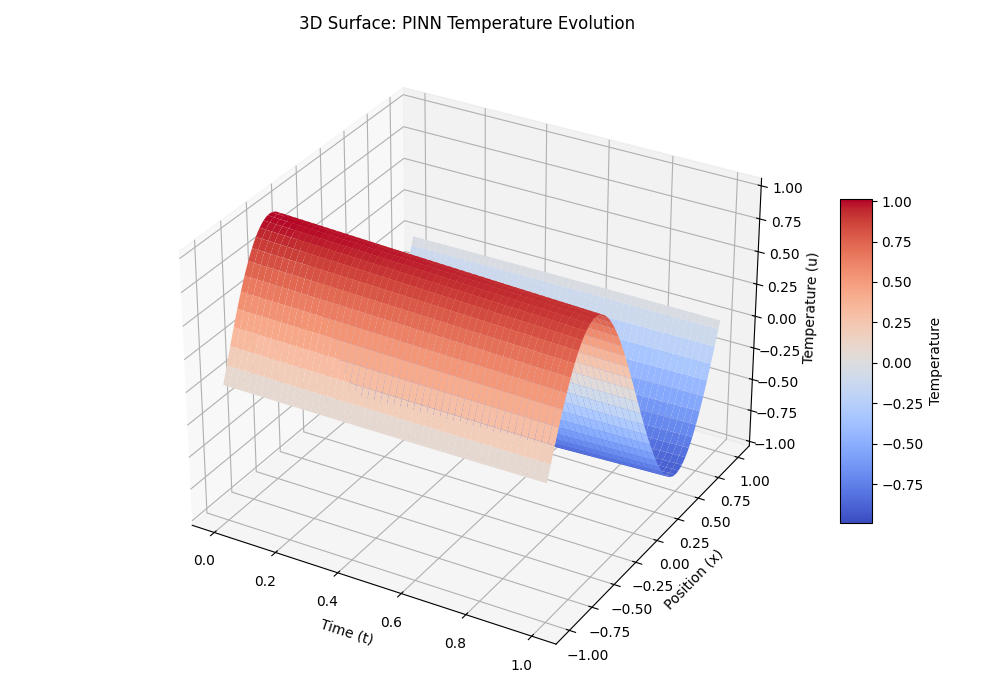
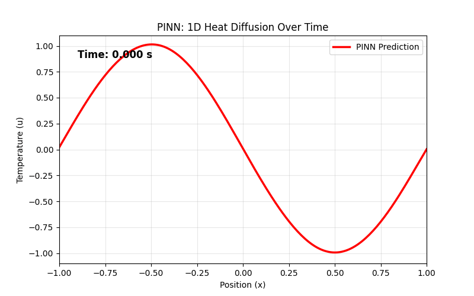

# Physics-Informed Neural Network (PINN) for 1D Heat Equation

## 📌 Problem Statement

Traditional numerical modeling techniques such as **Finite Difference Methods (FDM)** or **Finite Element Methods (FEM)** require rigid spatial discretization and often face stability constraints (e.g., CFL conditions) when simulating transport phenomena.

This project demonstrates how a **Physics-Informed Neural Network (PINN)** can solve the **1D Heat Diffusion Equation** by embedding the governing Partial Differential Equation (PDE) directly into the neural network loss function using **automatic differentiation**.

Unlike classical solvers, the PINN learns a **continuous surrogate model** that approximates the temperature field across space and time without relying on interior labeled grid data.

The model is rigorously validated against:

- **Explicit Finite Difference Method (FDM)**
- **Exact Analytical Solution**

---

# 🧮 Governing Physics

The heat diffusion process is governed by the **parabolic PDE**:

\[
\frac{\partial u}{\partial t} = \alpha \frac{\partial^2 u}{\partial x^2}
\]

### Domain & Physical Constraints

| Parameter | Value |
|----------|------|
Spatial Domain | \(x \in [-1,1]\) |
Temporal Domain | \(t \in [0,1]\) |
Thermal Diffusivity | \(\alpha = 0.01\) |

### Initial Condition

\[
u(x,0) = -\sin(\pi x)
\]

### Boundary Conditions

\[
u(-1,t)=0,\quad u(1,t)=0
\]

### Analytical Solution

\[
u(x,t) = -e^{-\alpha\pi^2t}\sin(\pi x)
\]

---

# ⚙️ PINN Methodology

## Network Architecture
```text
Inputs: (x, t) 
   │
   ├─► [ Dense Layer (32) + Tanh ]
   ├─► [ Dense Layer (32) + Tanh ]
   ├─► [ Dense Layer (32) + Tanh ]
   ├─► [ Dense Layer (32) + Tanh ]
   │
Output: Temperature u(x, t)
```

The **tanh activation function** is used because it is **twice differentiable**, allowing PyTorch's **Autograd** to compute second-order spatial derivatives required for the PDE residual.

---

## PINN Loss Formulation

The network learns by minimizing a **composite loss function**:

\[
L_{total} = L_{data} + L_{PDE}
\]

### Data Loss

Mean squared error enforcing **Boundary Conditions (BC)** and **Initial Condition (IC)**.

### Physics Loss

Mean squared error of the **PDE residual** computed via automatic differentiation at **10,000 randomly sampled collocation points**.

---

# 📊 Experimental Results & Validation

The trained PINN successfully learns the spatiotemporal heat diffusion process while respecting the governing physics.

### Error Metrics

| Metric | Value |
|------|------|
L2 Relative Error | **0.0109** |
PDE Residual | Near zero across domain |

---

# 🔬 Spatiotemporal Solution Comparison

The following figure compares:

- Finite Difference numerical solution
- Exact analytical solution
- PINN prediction
- Absolute error


---

# 📉 Training Convergence & PDE Residual

Training diagnostics show stable convergence and effective physics enforcement.

The plot includes:

- Total loss
- Physics loss
- Boundary / initial condition loss
- PDE residual distribution


---

# 🌡️ 3D Temperature Surface

A 3D surface visualization of the PINN-predicted temperature field \(u(x,t)\).

This shows the continuous diffusion behavior learned by the neural network.



---

# 🎞️ Heat Diffusion Animation

The animation below shows the **time evolution of temperature across the spatial domain** predicted by the PINN model.



---

# 🔬 Ablation Study

Different network depths were evaluated to identify the optimal architecture.

| Layers | Neurons | L2 Error |
|------|------|------|
3 | 32 | 0.0154 |
4 | 32 | **0.0109 (Selected Model)** |
5 | 32 | 0.0121 |

---

# ⏱️ Computational Benchmark

| Method | Training Time | Inference Time | Description |
|------|------|------|------|
FDM (CPU) | N/A | ~0.15 s | Classical grid solver |
PINN (CPU) | ~49 s | ~0.02 s | Continuous surrogate |
PINN (GPU) | ~6 s | <0.005 s | Highly parallel |

### Engineering Insight

While PINNs require **upfront training cost**, once trained they act as **fast surrogate models**, capable of evaluating the solution at **arbitrary continuous space–time coordinates**.

This property is extremely useful in **HPC simulation workflows**.

---

# 🚀 Tech Stack

- **Language:** Python  
- **Deep Learning:** PyTorch (Autograd, Optimizers)  
- **Scientific Computing:** NumPy, Matplotlib  
- **Core Topics:**  
  - Partial Differential Equations  
  - Transport Phenomena  
  - Scientific Machine Learning (SciML)

---

# 👨‍💻 Author

**Het Ram**  